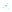
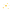
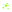

# Reactive Graph Design

## Palette

| No | Name             | R   | G   | B   | HEX                                            |
|----|------------------|-----|-----|-----|------------------------------------------------|
| 1  | malachite        | 4   | 231 | 98  | #04e762ff | 
| 2  | selective-yellow | 245 | 183 | 0   | #f5b700ff |
| 3  | celestial-blue   | 0   | 161 | 228 | #00a1e4ff |
| 4  | mexican-pink     | 220 | 0   | 115 | #dc0073ff |
| 5  | chartreuse       | 137 | 252 | 0   | #89fc00ff |

## Fonts

| Name            | Type            | License               | Description                                                                                                                                                                                                                                                                                                                                                                                                        |
|-----------------|-----------------|-----------------------|--------------------------------------------------------------------------------------------------------------------------------------------------------------------------------------------------------------------------------------------------------------------------------------------------------------------------------------------------------------------------------------------------------------------|
| Devicon         | Icon Font       | MIT                   | Devicon aims to gather all logos representing development languages and tools.                                                                                                                                                                                                                                                                                                                                     |
| Fira Code       | Monospace Font  | Open Font License 1.1 | Monospaced font with programming ligatures.                                                                                                                                                                                                                                                                                                                                                                        |
| Metropolis      | Sans Serif Font | Unlicense             | Metropolis is a modern, geometric typeface designed for optimal readability.                                                                                                                                                                                                                                                                                                                                       |
| Roboto          | Regular Font    | Apache License 2.0    | Roboto has a dual nature. It has a mechanical skeleton and the forms are largely geometric. At the same time, the font features friendly and open curves. While some grotesks distort their letterforms to force a rigid rhythm, Roboto doesn’t compromise, allowing letters to be settled into their natural width. This makes for a more natural reading rhythm more commonly found in humanist and serif types. |
| Source Code Pro | Monospace Font  | Open Font License 1.1 | Source Code Pro is a set of OpenType fonts that have been designed to work well in user interface (UI) environments.                                                                                                                                                                                                                                                                                               |

## Logo

| Color            | Full                                                                                                | Outer                                                                                                 | Inner                                                                                                 | Inverse                                                                                                   |
|------------------|-----------------------------------------------------------------------------------------------------|-------------------------------------------------------------------------------------------------------|-------------------------------------------------------------------------------------------------------|-----------------------------------------------------------------------------------------------------------|
| Black            |             |             |             |             |
| White            |             |             |             |             |
| Malachite        |         |         |         |         |
| Selective Yellow |  |  |  |  |
| Celestial Blue   |    |    |    |    |
| Mexican Pink     |      |      |      |      |
| Chartreuse       |        |        |        |        |
| Black and White  |       |                                                                                                       |                                                                                                       |                                                                                                           |
